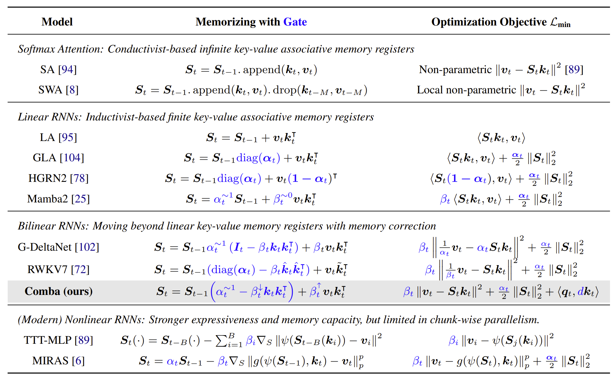

# 闭环递归架构Comba | 标量加低秩状态变换，前向传播大幅提速，CV，NLP等多项任务取得SOTA

近日由香港科技大学广州与上海AI Lab联合发布了一项研究成果：Improving Bilinear RNNs with Closed-loop Control，该文章首先对最近高效序列建模方法，包括Transformer，线性注意力，状态空间模型的发展进行了全面的总结，将近期提出的RWKV7，Gated-DeltaNet等模型归结为Bilinear RNN并分析了其理论优势。随后该文章提出了一种新型的递归模型架构Comba，采用标量加低秩（SPLR）状态变换以及输出矫正技术，基于Triton实现了硬件友好的分块并行优化，由于SPLR的结构优势，Comba只需要计算一次逆矩阵，从而在前向传播相比Gated-DeltaNet提升了40%的速度，并在CV，NLP等多项任务上取得SOTA效果。代码已开源并即将整合到FlashLinearAttention库中。

  
  

\
**论文标题**
 
Comba: Improving Bilinear RNNs with Closed-loop Control

**论文链接**
 
https://arxiv.org/abs/2506.02475

**代码链接**
 
https://github.com/AwesomeSeq/Comba-triton

  
  

## 1. 背景知识和相关工作
Transformer依赖于Softmax注意力，虽然可以依赖于为矩阵乘法所设计的现代GPU高效并行计算并且效果强大，但在训练中时间复杂度为二次并且在推理过程中KV-Cache会使得内存无限制的增长，使得其在长序列任务中受限。一些工作包括滑动窗口注意力、稀疏注意力和更高效的KV Cache管理在一定程度上缓解了瓶颈，却仍未摆脱二次注意力的基本范式。自mamba爆火之后，递归模型快速崛起。这些模型把长序列压缩进固定大小的状态S，使得推理只需恒定大小的内存开销以及 $\mathcal{O}$(1) 时间复杂度，逐渐成为了Transformer的有力替代品。

### **第一阶段：数据依赖的门控**

递归模型有着很多发展路径，例如线性注意力系列，最初对q和k分别通过核函数来近似整体的softmax操作，由此可以将注意力计算重写为关于时间的线性复杂度： $\mathbf{O}=\mathbf{\phi}(\mathbf{Q})(\mathbf{\phi}(\mathbf{K})\mathbf{V})$。例如状态空间模型系列，最初源自Hippo理论，提出了一类正交多项式投影算子，当选取闭合递归多项式族时可以表达为递归形式。这些模型在最初提出的时候效果并不如transformer，因为它们缺少了像transformer中自注意力机制那样的自适应带权信息融合。随后，门控线性注意力或者选择状态空间（Mamba）系列模型提出了数据依赖的门控机制，长序列任务上取得了不错的效果。并在2024年下半年的各类工作中被统一称呼为Linear RNNs，这些模型可以看作一个关于key-value联想记忆的线性寄存器系统：

  
  

### **第二阶段：从赫布生物学习法则到Delta学习法则**
尽管第一阶段中带有数据门控的线性RNNs在长序列任务上取得了不错的效果，但仍然存在着一些问题，例如为了能够在现代GPU上面快速计算，这些模型往往将门控简化为标量，导致状态更新的表达能力不足。并且这类模型基于加法的更新机制，不断的将key-value所构成的外积记忆加到记忆状态中，导致模型缺少一个准则来判断哪些记忆是重要的，哪些记忆是不重要的，数据依赖的门控会使得状态中存储的记忆会平等的遗忘。为了解决这些问题，研究者们开始探索更复杂的状态更新机制。

最近Gated-DeltaNet通过Delta学习法则对模型引入了纠错能力，使得通过key从状态中查询出对应的历史记忆更接近于当前输入value，这个机制也等价于基于Delta损失对记忆进行随机梯度下降。这使得递归模型推动到如下形式：

  
  

一方面，系统的状态变换矩阵从原本的标量进化为了类似Household变换的矩阵形式，大大增强了模型的表达能力，同时相比于密集实矩阵易于处理。有趣的是这和Hippo理论不谋而合：任何正交多项式投影算子都可以被表示为对角加低秩分量的组合形式。

另一方面，从几何视角来看Householder定义了一个以当前时间步key为法线的镜面，根据强度的不同可以选择性地保留或抑制模型状态中储存的记忆，从而对有限的记忆容量进行更高效的记忆管理。某种程度上可以视为对递归模型 ”KV Cache” 的施密特正交分解。

  
  

**Bilinear RNNs:** 这类模型由于引入了状态S和key的乘积项，其动力学已经不再是线性的了，再叫Linear RNNs有些不合适了。由于**这类模型对于状态和输入分别是线性的但整体不是，动力学形式上属于双线性系统，一种保持着非线性行为的可控系统**，因此本篇文章将这类模型称为Bilinear RNNs。

在此基础上衍生了各种改进工作（具体参考论文第二章节），同时像是TTT（Test-Time-Learning）等一系列模型则从优化器的角度对模型进行设计，并引入了基于MLP的深度记忆，高阶优化器，以及动量等操作，这类模型又不属于Blinear RNNs，可以被看作现代版本的Nonlinear RNNs。虽然这些非线性操作理论上比Bilinear RNNs有着更强的表现力，但是牺牲了硬件高效的分块并行计算能力，哪怕是采用小批次梯度下降来训练模型，速度也大幅度落后Gated-DeltaNet等模型。并且最近研究表明对于结构化数据如视频（帧）等采用小批次梯度下降是有效的，但是对于语言建模任务，单步梯度下降（类似Gated-DeltaNet）仍然是性能最优的。综合考虑，Comba沿用了Bilinear RNNs的形式，并基于Triton编写了高效分块并行计算算子。该文章在文章中Table1对这些模型进行了全面总结：

  
  

## 2. Comba架构：基于闭环控制理论
根据控制理论，Mamba，GLA等模型属于开环系统（关于key-value联想记忆），其输出不会对控制行为产生反馈。相比之下，另一类系统，被称为闭环控制系统，采用负反馈来增强系统的适应性，并允许它处理更复杂的动态任务。在该文章中，如下图所示，Comba采用两阶段反馈策略：首先通过基于状态的反馈P对输入信息（value）进行修正，然后使用相同的反馈机制对输出进行类似的校正。从这个角度来看，TTT、DeltaNet和RWKV-7等模型只包含了第一阶段的状态反馈校正，缺乏输出校正，因此不是严格的闭环系统。

  
  

该文章选用key向量来作为反馈（关于反馈的选择文章中进行了细致讨论），最终该文章可以将Comba写为如下递归形式：

  
  

相比于之前的Bilinear RNNs，Comba主要有两点不同：
1. **状态变换**：Comba采用了标量加低秩（SPLR）状态变换，该文章会在随后部分表明这个形式只需要计算一次逆矩阵，从而相比Gated-DeltaNet速度上有了大幅度提升。并且相比于RWKV7中的对角加低秩（DPLR）状态变换，SPLR状态变换已经有着足够的表达能力并且相比于标准Transformer几乎不引入额外参数，更易于从Transformer蒸馏出该递归形式。
2. **输出校正**：Comba在输出端引入了输出矫正机制，从神经记忆的角度来看，key保证记忆value被尽可能清晰地存储，从而使query能够精确地查询。输出校正直接促进了这一过程，并在实验结果中显著降低了模型的困惑度。

## 3. 硬件高效的分块并行计算
由于现代GPU是为矩阵乘法所设计的，导致递归模型在较短序列的计算时通常比Transformer要慢，为了最大化矩阵乘法Flops，类似于Mamba2，GLA，DeltaNet等模型，Comba采取如下块间递归，块内并行的方式，在序列维度上高效并行计算。

  
  

其中在计算中间变量W，U时，**Comba采用了SPLR状态变换，只需要一次逆矩阵计算（逆矩阵计算是主要速度瓶颈），而Gated-DeltaNet中需要两次**。对于头维度128的模型来说，Comba相比于Gated-DeltaNet在前向传播速度上提升了40%。在反向传递中，对于中等规模的模型（例如，隐藏维度1024或2048），由于重用缓存的逆矩阵M和块级状态（会产生额外显存占用），速度相比Gated-Deltanet提升不大。然而，在需要重新计算的大规模模型中，Comba有望提供显著的性能优势。

  
  

算子速度对比如下：PyTorch中的循环Comba产生了大量的计算开销，限制了其大规模预训练的可扩展性。对于较短的序列（例如1024），Flash-attention达到最快的速度，但其二次复杂度导致随着序列长度的增加效率降低。由于使用对角门控矩阵，GLA的操作速度较慢。虽然RetNet实现了最快的速度，但由于缺乏依赖数据的内存管理，它在性能上落后于其他模型。

  
  

最终该文章构建了Comba家族，分别就线性注意力形式，mamba形式，以及混合形式架构进行了实验探究，其中mamba形式类似于多value注意力，并共享维度为128的query和key。对于混合模型，该文章每8层混合一次softmax注意力，并基于FlashAttention实现。

## 4. 实验结果分析
该文章在此仅列举部分语言建模实验，对于长序列建模，图像分类，目标追踪等视觉任务请阅读原论文。

可以发现大多数递归模型在常识性推理任务中优于Transformer，因为它们的递归结构类似于一条思维链。SPLR结构的Comba优于IPLR结构的Gated-DeltaNet以及DPLR结构的RWKV7，并且保持着最快的计算速度。输出纠正可以显着减少困惑，从而实现精确记忆检索。该文章发现Mamba架构设计是次优的。MLP作为一种特殊的（非hebbian）键值记忆，补充了状态下的键值关联记忆，对于推理等任务尤为重要。该文章发现对于模型尺度，初始化输出校正因子d的选择应该有所不同，例如对于340M模型，d=0.02，对于1.3B模型，d=1比较好。

递归模型由于其有限的状态空间，召回能力通常弱于拥有着无限记忆的Transformer，然而，Comba的召回性能与变压器非常接近。消融研究表明，输出校正对Comba的回忆性能有显著的促进作用，优化qk的相似度将增强模型检索精确记忆的能力，从而提高回忆性能。该文章还测试了Comba在MQAR任务上的综合回忆能力。

  
  

